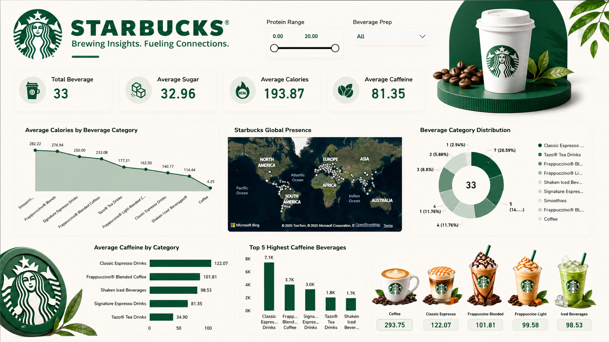

# ☕ Starbucks Beverage Analytics Dashboard | Power BI

[](https://powerbi.microsoft.com/)
[](https://learn.microsoft.com/en-us/dax/)
[](https://powerquery.microsoft.com/)
[](https://opensource.org/licenses/MIT)
[](https://www.linkedin.com/in/subodh-kumar-3520503ba/)

> **Executive Summary:** A nutritional, operational, and geospatial Business Intelligence case study created in Microsoft Power BI. Analyzing **33 core beverage profiles**, nutritional trade-offs (**Calories vs. Sugar vs. Caffeine**), and **Starbucks' global store footprint**, this dashboard bridges consumer health insights with commercial menu strategy.

---

## 📷 Executive Dashboard Preview



---

## 📌 Key Dashboard Metrics (KPIs)

| Metric | Benchmark Value | Analytical Significance |
| :--- | :--- | :--- |
| **Total Beverage Profiles** | **33 Core Drinks** | Comprehensive portfolio covering hot coffees, iced blends, teas, and smoothies |
| **Average Sugar Content** | **32.96 g** | Critical dietary metric for customer health awareness and sugar-reduction initiatives |
| **Average Calorie Load** | **193.87 kcal** | Balanced benchmark across dairy options, dessert blends, and light brews |
| **Average Caffeine Level** | **81.35 mg** | Core functional energy metric driving repeat customer morning traffic |
| **Global Store Footprint** | **Worldwide Network** | Geospatial store density across North America, Europe, Asia-Pacific, & Africa |

---

## 🎯 Project Objective & Business Use Case

In the modern food & beverage retail industry, consumers increasingly demand transparency in nutritional information (calories, sugar, and caffeine content) while seeking functional energy boosts. Starbucks menu designers and retail strategists face key trade-offs:
1. Which beverages provide optimal energy (caffeine) without excessive sugar or calorie loads?
2. How does beverage preparation (e.g., Nonfat Milk, Soymilk, Whole Milk) impact the protein and caloric profile?
3. How is the product portfolio distributed between traditional espresso staples and high-margin dessert/cold blends?
4. Where is Starbucks' physical footprint concentrated globally to support localized product rollouts?

**Objective:** Build an interactive, executive-ready Power BI dashboard that converts raw nutritional and store directory data into intuitive visual analytics, enabling menu planners, marketing teams, and health-conscious consumers to explore beverage profiles dynamically.

---

## ❓ Business Questions Answered

1. **Nutritional Benchmarking:** What is the average sugar, calorie, and caffeine content across all Starbucks beverage offerings?
2. **High-Calorie Drivers:** Which beverage categories carry the highest calorie load, and which provide low-calorie alternatives?
3. **Caffeine Potency:** Which beverage categories and individual drinks provide the highest caffeine concentration for energy-seeking consumers?
4. **Portfolio Distribution:** How are beverages distributed across major product lines (Classic Espresso, Frappuccino®, Teas, Smoothies)?
5. **Customization Impact:** How do protein sliders and preparation choices (Short Nonfat, Soymilk, Tall) adjust nutritional outcomes?
6. **Geographical Reach:** How are retail locations geographically dispersed across international markets?

---

## 🛠️ Tools & Technologies Used

- **Microsoft Power BI Desktop:** Visual layout, custom branding, interactive slicers, and theme development.
- **Power Query (M Engine):** Data cleaning, column standardization, unit normalization (converting grams, milligrams), null-value handling, and schema shaping.
- **DAX (Data Analysis Expressions):** Dynamic statistical measures, ranking formulas, conditional ratios, and category aggregations.
- **Geospatial Mapping (Microsoft Bing Visual):** Geospatial mapping of global store coordinates (`directory.csv`).
- **Data Modeling:** Analytical schema connecting beverage nutrition tables (`starbucks.csv`) with preparation dimension tables.

---

## 📐 Data Modeling & Key DAX Measures

### Core DAX Formulas:
```dax
// Average Calories
Average Calories = AVERAGE(Beverages[Calories])

// Average Sugar Content (g)
Average Sugar = AVERAGE(Beverages[Sugar_g])

// Average Caffeine Content (mg)
Average Caffeine = AVERAGE(Beverages[Caffeine_mg])

// Total Beverage Offerings
Total Beverage Count = COUNTROWS(Beverages)

// Top 5 Highest Caffeine Ranking
Top 5 Caffeine Rank = 
RANKX(
    ALL(Beverages[Beverage_Name]),
    [Average Caffeine],
    ,
    DESC
)
```

---

## 📈 Key Analytical Insights & Nutritional Findings

### 1. 🍰 Calorie Spectrum Extremes (Smoothies vs Brewed Coffee)
- **Highest Calorie Categories:** **Smoothies (282.22 kcal)** and **Frappuccino® Blended Coffee (276.94 kcal)** represent the highest calorie density due to fruit bases, syrup blends, and dairy fat.
- **Signature Espresso Drinks** average **250.00 kcal**, making them a sweet indulgence.
- **Lowest Calorie Champion:** **Brewed Coffee (4.25 kcal)** is essentially calorie-free, making it the premier choice for zero-calorie energy.
- **Light Alternative:** **Frappuccino® Light Blended Coffee (162.50 kcal)** cuts over **41% of calories** compared to standard Frappuccinos without compromising beverage identity.

### 2. ⚡ Caffeine Concentration: Classic Espresso Takes the Crown
- **Classic Espresso Drinks** deliver the highest average caffeine potency at **122.07 mg**, serving as the primary morning energy driver.
- **Frappuccino® Blended Coffee** averages **101.81 mg**, followed by **Shaken Iced Beverages (98.53 mg)**.
- **Tazo® Tea Drinks** offer the gentlest caffeine stimulation at **34.90 mg**, making them ideal for low-caffeine and late-afternoon consumption.

### 3. 🥤 Menu Portfolio Composition
- The beverage catalog is heavily anchored by **Classic Espresso Drinks (20.59%)** and **Frappuccino® Light options (14.71%)**.
- Tazo® Teas and Shaken Iced Beverages each comprise **11.76%** of menu offerings, demonstrating strong diversification between hot craft coffees and refreshing cold beverages.

### 4. 🌍 Global Retail Store Footprint
- Store distribution mapping confirms dense cluster saturation in **North America (United States & Canada)**, rapid expansion throughout **Europe and East Asia (China, Japan, South Korea)**, and strategic capital hubs across Latin America and Australia.

---

## 💡 Strategic Recommendations for Menu & Retail Teams

1. **Spotlight the "Smart Swap" Campaign:** Promote Frappuccino® Light (162.5 kcal) directly alongside standard Frappuccino® Blends (276.9 kcal) to capture health-minded consumers without losing sweet beverage sales.
2. **Promote Brewed Coffee as Clean Pre-Workout:** Position regular brewed coffee (293.75 mg caffeine peak, 4.25 kcal) as a clean, low-cost pre-workout alternative for fitness enthusiasts.
3. **Expand Evening Tea Lines:** Emphasize Tazo® Tea Drinks (34.90 mg caffeine) in post-3 PM retail promotions to drive afternoon foot traffic without disrupting sleep quality.
4. **Protein Customization Filters:** Utilize protein-enhanced milk formulations (e.g., Soy, Oat, High-Protein Skim) to appeal to the growing high-protein lifestyle market.

---

## 📂 Repository Structure

```
├── starbucks.pbix           # Interactive Power BI report with all models & visuals
├── starbucks.csv            # Cleaned nutritional dataset (calories, sugar, caffeine)
├── directory.csv            # Global store directory dataset (latitude, longitude, city)
├── dashboard.png            # High-resolution dashboard screenshot
└── README.md                # Analytical case study & technical documentation
```

---

## 🚀 How to Run & Explore

1. Install [Microsoft Power BI Desktop](https://powerbi.microsoft.com/desktop/).
2. Clone this repository:
   ```bash
   git clone https://github.com/subodhdataworks/-Starbucks-Beverage-Analytics-Dashboard-Power-BI.git
   ```
3. Open `starbucks.pbix` in Power BI Desktop.
4. Interact with the **Protein Range** slider and **Beverage Prep** dropdown to examine nutritional shifts dynamically across all visuals.

---

## 👨‍💻 Author

**Subodh Kumar**  
*Data Analyst | Business Intelligence Specialist*  
- 📜 **Certification:** [Microsoft Certified: Power BI Data Analyst Associate (PL-300)](https://learn.microsoft.com/users/SubodhKumar-0850)  
- 💼 **LinkedIn:** [linkedin.com/in/subodh-kumar-3520503ba](https://www.linkedin.com/in/subodh-kumar-3520503ba/)  
- 🐙 **GitHub:** [@subodhdataworks](https://github.com/subodhdataworks)  
- 📧 **Email:** [subodh.dataworks@gmail.com](mailto:subodh.dataworks@gmail.com)
