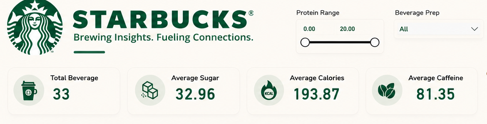
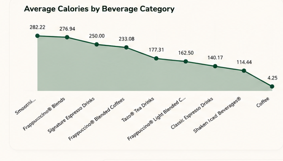
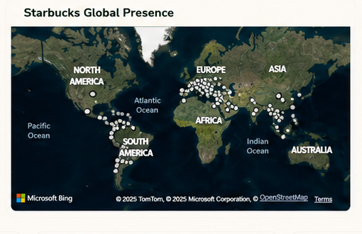
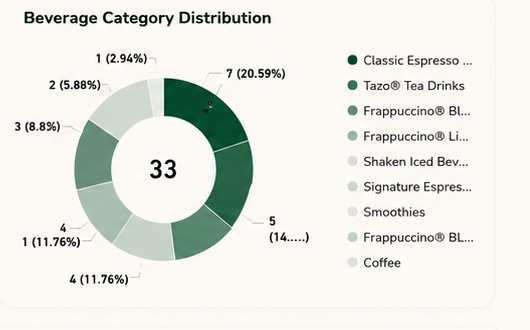
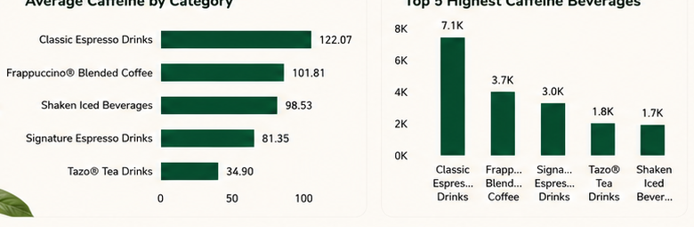
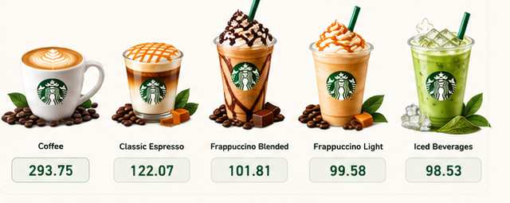

# ☕ Starbucks Beverage Analytics Dashboard | Power BI

[](https://powerbi.microsoft.com/)
[](https://learn.microsoft.com/en-us/dax/)
[](https://powerquery.microsoft.com/)
[](https://opensource.org/licenses/MIT)
[](https://www.linkedin.com/in/subodh-kumar-3520503ba/)

> **Executive Summary:** A nutritional, operational, and geospatial Business Intelligence case study created in Microsoft Power BI. Analyzing **33 core beverage profiles**, nutritional trade-offs (**Calories vs. Sugar vs. Caffeine**), and **Starbucks' global store footprint**, this dashboard bridges consumer health insights with commercial menu strategy.

---

## 📷 Full Executive Dashboard Overview

<p align="center">
  
</p>

---

## 📌 1. Executive Slicers & High-Level KPIs

<p align="center">
  
</p>

| Metric | Benchmark Value | Analytical Significance |
| :--- | :--- | :--- |
| **Total Beverage Profiles** | **33 Core Drinks** | Comprehensive portfolio covering hot coffees, iced blends, teas, and smoothies |
| **Average Sugar Content** | **32.96 g** | Critical dietary metric for customer health awareness and sugar-reduction initiatives |
| **Average Calorie Load** | **193.87 kcal** | Balanced benchmark across dairy options, dessert blends, and light brews |
| **Average Caffeine Level** | **81.35 mg** | Core functional energy metric driving repeat morning customer traffic |
| **Interactive Slicers** | **Protein & Prep** | Dynamic slider (0.00 to 20.00) & preparation filter (Short Nonfat, Soymilk, Tall, etc.) |

---

## 🎯 2. Project Objective & Business Use Case

In the modern food & beverage retail industry, consumers increasingly demand transparency in nutritional information (calories, sugar, and caffeine content) while seeking functional energy boosts. Starbucks menu designers and retail strategists face key trade-offs:
1. **Health vs. Indulgence Balance:** Which beverages provide optimal energy (caffeine) without excessive sugar or calorie loads?
2. **Customization Impact:** How does beverage preparation (e.g., Short Nonfat Milk, Soymilk, Whole Milk) impact the protein and caloric profile?
3. **Portfolio Diversification:** How is the product portfolio distributed between traditional espresso staples and high-margin dessert/cold blends?
4. **Geographical Reach:** Where is Starbucks' physical store footprint concentrated globally to support localized product rollouts?

**Objective:** Build an interactive, executive-ready Power BI dashboard that converts raw nutritional and store directory data into intuitive visual analytics, enabling menu planners, marketing teams, and health-conscious consumers to explore beverage profiles dynamically.

---

## ❓ 3. Key Business Questions Answered

* ⚖️ **Nutritional Benchmarking:** What is the average sugar, calorie, and caffeine content across all Starbucks beverage offerings?
* 🔥 **High-Calorie Drivers:** Which beverage categories carry the highest calorie load, and which provide low-calorie alternatives?
* ⚡ **Caffeine Potency:** Which beverage categories and individual drinks provide the highest caffeine concentration for energy-seeking consumers?
* 📊 **Portfolio Distribution:** How are beverages distributed across major product lines (Classic Espresso, Frappuccino®, Teas, Smoothies)?
* 🥛 **Customization Impact:** How do protein sliders and preparation choices (Short Nonfat, Soymilk, Tall) adjust nutritional outcomes?
* 🌍 **Geographical Reach:** How are retail locations geographically dispersed across international markets?

---

## 📈 4. In-Depth Visual Analysis & Findings

### A. Average Calories by Beverage Category (The Calorie Spectrum)

<p align="center">
  
</p>

* **Highest Calorie Heavyweights:**
  - **Smoothies (282.22 kcal):** Highest calorie load, driven by banana/fruit purees and dairy bases.
  - **Frappuccino® Blends (276.94 kcal):** Second highest, carrying significant whipped cream and syrup density.
  - **Signature Espresso Drinks (250.00 kcal):** Indulgent flavored lattes and mochas.
* **Middle Ground:**
  - **Frappuccino® Blended Coffees (233.08 kcal)** and **Tazo® Tea Drinks (177.31 kcal)**.
  - **Frappuccino® Light Blended Coffee (162.50 kcal):** Achieves a **41% calorie reduction** over standard Frappuccinos!
* **Low-Calorie Champions:**
  - **Classic Espresso Drinks (140.17 kcal)** and **Shaken Iced Beverages® (114.44 kcal)**.
  - **Brewed Coffee (4.25 kcal):** Virtually zero calories, the purest choice for dietary purists.

---

### B. Global Store Footprint & Retail Distribution

<p align="center">
  
</p>

* **Geospatial Mapping via Microsoft Bing:** Visualizes worldwide store density using exact store coordinates (`directory.csv`).
* **Core Densities:**
  - **North America:** Dense saturation across metropolitan and suburban consumer hubs.
  - **Europe & United Kingdom:** Established presence across major transport hubs and high streets.
  - **Asia-Pacific (China, Japan, South Korea):** Massive urban penetration and rapid expansion.
  - **Latin America & Oceania:** Strategic capital city hubs supporting brand visibility.

---

### C. Beverage Portfolio Category Distribution

<p align="center">
  
</p>

* **Core Menu Backbone:**
  - **Classic Espresso Drinks:** 7 items (**20.59%** of the menu).
  - **Frappuccino® Light:** 5 items (**14.71%**).
  - **Tazo® Tea Drinks:** 4 items (**11.76%**).
  - **Shaken Iced Beverages:** 4 items (**11.76%**).
  - **Frappuccino® Blends:** 3 items (**8.8%**).
  - **Signature Espresso:** 2 items (**5.88%**).
  - **Smoothies & Coffee:** 1 item each (**2.94%** each).
* **Strategic Observation:** Over **50%** of offerings target cold, iced, and blended beverages, capturing younger demographics and afternoon snacking occasions.

---

### D. Caffeine Analysis & Top 5 Power Beverages

<p align="center">
  
</p>

* **Category Caffeine Hierarchy:**
  - 🥇 **Classic Espresso Drinks:** **122.07 mg** average caffeine.
  - 🥈 **Frappuccino® Blended Coffee:** **101.81 mg** average caffeine.
  - 🥉 **Shaken Iced Beverages:** **98.53 mg** average caffeine.
  - ☕ **Signature Espresso Drinks:** **81.35 mg** average caffeine.
  - 🍵 **Tazo® Tea Drinks:** **34.90 mg** average caffeine (low-caffeine afternoon alternative).
* **Top 5 Power Rankings:** Classic Espresso drinks accumulate over **7.1K total mg** of caffeine across portfolio variations, leading functional energy delivery.

---

### E. Product Showcase Renders & Benchmark Stats

<p align="center">
  
</p>

| Beverage Style | Visual Highlight | Functional Caffeine | Calorie Profile | Best Customer Match |
| :--- | :---: | :---: | :---: | :--- |
| **Brewed Coffee** | ☕ Classic White Mug | **293.75 mg** *(Peak)* | **4.25 kcal** *(Ultra-Light)* | Fitness enthusiasts, clean pre-workout |
| **Classic Espresso** | 🥛 Layered Macchiato | **122.07 mg** | **140.17 kcal** | Morning commuter energy staple |
| **Frappuccino® Blended** | 🍫 Chocolate Drizzle | **101.81 mg** | **276.94 kcal** | Afternoon sweet indulgence & treat |
| **Frappuccino® Light** | 🍦 Caramel Swirl | **99.58 mg** | **162.50 kcal** | Calorie-conscious dessert coffee lover |
| **Iced Beverages** | 🧊 Matcha Green Tea | **98.53 mg** | **114.44 kcal** | Refreshing afternoon focus boost |

---

## 🛠️ 5. Tools & Analytics Engineering

- **Microsoft Power BI Desktop:** Visual layout, custom branding, interactive slicers, and theme development.
- **Power Query (M Engine):** Data cleaning, column standardization, unit normalization (converting grams, milligrams), null-value handling, and schema shaping.
- **DAX (Data Analysis Expressions):** Dynamic statistical measures, ranking formulas, conditional ratios, and category aggregations.
- **Geospatial Mapping (Microsoft Bing Visual):** Geospatial mapping of global store coordinates (`directory.csv`).
- **Data Modeling:** Analytical schema connecting beverage nutrition tables (`starbucks.csv`) with preparation dimension tables.

### Core DAX Formulas:
```dax
// Average Calories
Average Calories = AVERAGE(Beverages[Calories])

// Average Sugar Content (g)
Average Sugar = AVERAGE(Beverages[Sugar_g])

// Average Caffeine Content (mg)
Average Caffeine = AVERAGE(Beverages[Caffeine_mg])

// Total Beverage Offerings
Total Beverage Count = COUNTROWS(Beverages)

// Top 5 Highest Caffeine Ranking
Top 5 Caffeine Rank = 
RANKX(
    ALL(Beverages[Beverage_Name]),
    [Average Caffeine],
    ,
    DESC
)
```

---

## 💡 6. Strategic Recommendations for Menu Strategy

1. **Spotlight the "Smart Swap" Campaign:** Promote Frappuccino® Light (162.5 kcal) directly alongside standard Frappuccino® Blends (276.9 kcal) to capture health-minded consumers without losing sweet beverage sales.
2. **Promote Brewed Coffee as Clean Pre-Workout:** Position regular brewed coffee (293.75 mg caffeine peak, 4.25 kcal) as a clean, low-cost pre-workout alternative for fitness enthusiasts.
3. **Expand Evening Tea Lines:** Emphasize Tazo® Tea Drinks (34.90 mg caffeine) in post-3 PM retail promotions to drive afternoon foot traffic without disrupting sleep quality.
4. **Protein Customization Filters:** Utilize protein-enhanced milk formulations (e.g., Soy, Oat, High-Protein Skim) to appeal to the growing high-protein lifestyle market.

---

## 📂 Repository Structure

```
├── starbucks.pbix           # Interactive Power BI report with all models & visuals
├── starbucks.csv            # Cleaned nutritional dataset (calories, sugar, caffeine)
├── directory.csv            # Global store directory dataset (latitude, longitude, city)
├── dashboard.png            # High-resolution full dashboard screenshot
├── docs/                    # Visual analytical breakdown assets
│   ├── kpis.png             # Header, interactive slicers & 4 KPI cards
│   ├── calories.png         # Average calories by category line/area chart
│   ├── global_map.png       # Starbucks global store presence map
│   ├── categories.png       # Beverage category distribution donut chart
│   ├── caffeine.png         # Average caffeine & Top 5 column chart
│   └── products.png         # Product visual showcase cards with stats
└── README.md                # Comprehensive visual analytics case study
```

---

## 🚀 How to Run & Explore

1. Install [Microsoft Power BI Desktop](https://powerbi.microsoft.com/desktop/).
2. Clone this repository:
   ```bash
   git clone https://github.com/subodhdataworks/-Starbucks-Beverage-Analytics-Dashboard-Power-BI.git
   ```
3. Open `starbucks.pbix` in Power BI Desktop.
4. Interact with the **Protein Range** slider and **Beverage Prep** dropdown to examine nutritional shifts dynamically across all visuals.

---

## 👨‍💻 Author

**Subodh Kumar**  
*Data Analyst | Business Intelligence Specialist*  
- 📜 **Certification:** [Microsoft Certified: Power BI Data Analyst Associate (PL-300)](https://learn.microsoft.com/users/SubodhKumar-0850)  
- 💼 **LinkedIn:** [linkedin.com/in/subodh-kumar-3520503ba](https://www.linkedin.com/in/subodh-kumar-3520503ba/)  
- 🐙 **GitHub:** [@subodhdataworks](https://github.com/subodhdataworks)  
- 📧 **Email:** [subodh.dataworks@gmail.com](mailto:subodh.dataworks@gmail.com)
